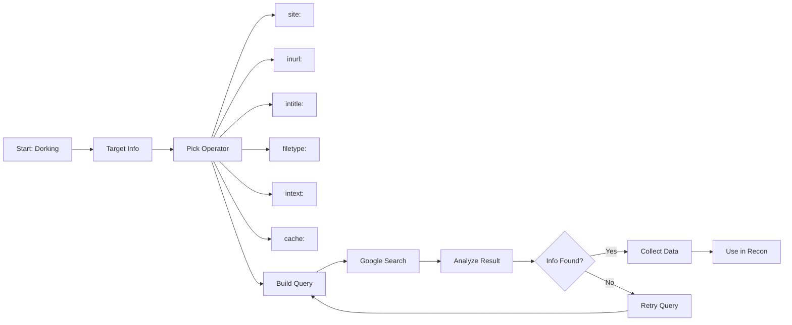

## 🧠 Google Dorks – Exploit Search Techniques

These advanced **Google search queries** (aka *Google Dorks*) are used to find **exposed files**, **leaked credentials**, **open directories**, **subdomains**, and other juicy info that shouldn't be public. These are widely used in **ethical hacking**, **bug bounty**, and **OSINT** operations.

> 📚 Source: [Exploit-DB Google Hacking Database (GHDB)](https://www.exploit-db.com/google-hacking-database)

---


---

### 🔐 1. **Exposed Credentials & Secrets**

These dorks target common configuration and secrets files that may contain sensitive credentials:

#### 🔸 `.env` Files – API Keys, DB Passwords, etc.

```dork
inurl:.env DB_PASSWORD

```

#### 🔸 JSON Files – API Keys in Code

```dork
filetype:json intext:api_key

```

#### 🔸 `.ini` Configuration Files – Database Info

```dork
filetype:ini intext:db_user

```

#### 🔸 YAML Config Files – Passwords in Plaintext

```dork
filetype:yaml intext:password

```

#### 🔸 AWS Keys in Code Repositories or Docs

```dork
intext:"AWS_SECRET_ACCESS_KEY"

```

---

Let me know if you're ready for the **next category** — like:

* 📁 *Exposed Directories & File Listings*
* 🌐 *Subdomain Discovery & Dev Environments*
* 🔓 *Admin Panels & Login Portals*
* 🔍 *Sensitive Documents (PDF, XLS, CSV leaks)*

---

📖 Reference: Notes inspired by guidance from Mr. Sachin Verma Sir ([Armour Infosec](https://www.armourinfosec.com/)) and enriched with further improvements and updates

---

# Google Dorking — Bug Bounty Recon (Advanced & Pro)

**Short summary:** Google Dorking = advanced search operators ka systematic use to passively find exposed assets, secrets, admin panels, backups, misconfigured cloud buckets, etc. Use responsibly & only on in-scope targets. (GHDB is the canonical dork list; TakSec and recon writeups are great living resources). ([Exploit Database](https://www.exploit-db.com/google-hacking-database?utm_source=chatgpt.com))

---

## 0. Legal / Ethics (Absolute must-read)

* Sirf **in-scope** targets pe dorking karo (program TOS/VDP check karna essential).
* Dorking se jo data milta hai wo publicly indexed hai — still: sensitive data access reporting require karta hai responsible disclosure.
* Automated scraping of Google violates their TOS — for automation use **Google Custom Search API** or other permitted APIs; otherwise do manual / throttled queries. (Automation caveats are below.)

---

## 1. Quick operators cheat-sheet (essentials)

* `site:` — domain restricted
* `inurl:` — URL contains
* `intitle:` — page title
* `filetype:` / `ext:` — file extension
* `allintitle:` / `intext:` — text in page body
* `cache:` — Google cached copy
* Combine with boolean `|`, `-` (negation) and quotes for exact phrases

---

## 2. Sensitive files & config (high priority)

* Config / secrets / creds:
* `site:example.com (ext:env | ext:conf | ext:cnf | ext:ini | ext:json | ext:htpasswd | ext:htaccess) "password" | "secret" | "api_key"`


* Backups / temp / old:
* `site:example.com (ext:bak | ext:backup | ext:old | ext:tmp | ext:swp | inurl:~)`


* DB dumps:
* `site:example.com (ext:sql | ext:db | ext:mdb) "INSERT INTO" | "password"`


* Docs with keywords:
* `site:example.com (filetype:pdf | ext:doc | ext:xls) intext:"password" | intext:"confidential" | intext:"internal use only"`


---

## 3. Subdomain & asset discovery (scale the attack surface)

* All indexed subdomains:
* `site:*.example.com`


* Hide common subdomains to reveal odd ones:
* `site:*.example.com -site:www.example.com -site:shop.example.com`


* Dev / staging / internal:
* `site:*.example.com inurl:dev | inurl:test | inurl:stage | inurl:staging`


* API endpoints:
* `site:example.com inurl:api | inurl:rest | inurl:v1 | inurl:v2`


---

## 4. Login panels, admin interfaces & indexed dashboards

* Login/admin discovery:
* `site:example.com inurl:login | inurl:signin | inurl:admin | inurl:dashboard | intitle:"Login" | intitle:"Sign In" | intitle:"Admin"`


* Indexed directory pages:
* `intitle:"index of /admin" site:example.com`


* Framework/CMS specific:
* WP: `site:example.com inurl:wp-admin | inurl:wp-login.php`
* Joomla/Drupal patterns: `site:example.com intext:"Powered by Joomla" | intext:"Powered by Drupal"`


---

## 5. Vulnerable parameters & LFI/RFI candidates

* Common URL params to inspect:
* `site:example.com inurl:"?id=" | inurl:"?page=" | inurl:"?file=" | inurl:"?url=" | inurl:redirect= | inurl:debug=`


* High-risk keywords in URL:
* `inurl:conf | inurl:env | inurl:cgi | inurl:backup | inurl:sql | inurl:php site:example.com`


---

## 6. Public-code & repo leaks (GitHub / GitLab / Bitbucket)

* Search for hardcoded secrets related to target:
* `site:github.com "example.com" "password" | "api_key" | "secret" | "token"`


* Also check `firebaseio.com`, `jfrog.io`, Docker registry pages for leaked config/URLs. (TakSec & GHDB lists aggregate many real-world dorks.) ([GitHub](https://github.com/TakSec/google-dorks-bug-bounty?utm_source=chatgpt.com))

---

## 7. Cloud storage & common platforms

* Google Docs / Drive / OneDrive / Dropbox:
* `site:docs.google.com inurl:"/d/" "example.com"`
* `site:onedrive.live.com "example.com"`, `site:dropbox.com "example.com"`


* S3 / Azure blobs / Firebase:
* `site:s3.amazonaws.com "example.com"`
* `site:firebaseio.com "example.com"`


---

## 8. OSINT & personnel / program discovery

* Employee disclosure:
* `site:linkedin.com "@example.com" OR "name@example.com"`


* Bug bounty / VDP pages:
* `"submit vulnerability report" "example.com" | "powered by hackerone" | "powered by bugcrowd"`
* `site:*/security.txt "bounty"` — find policy / scope endpoints.


---

## 9. Indexes, open directories & misc

* Open dir:
* `intitle:"index of /" site:example.com`


* CMS-specific endpoints:
* WordPress ajax endpoint: `inurl:/wp-admin/admin-ajax.php site:example.com`


---

## 10. Automation — workflows & safe methods (Pro)

**Do:**

* Use GHDB + curated GitHub dork repos as source (don’t brute-force Google directly). ([Exploit Database](https://www.exploit-db.com/google-hacking-database?utm_source=chatgpt.com))
* For scale, use **Google Custom Search API** (paid, rate-limited) or other indexed APIs (Bing Search API) — this avoids TOS breach.
* Save unique results to CSV / SQLite with fields: `url, title, operator, discovered_on, notes, verified` for ingestion into recon tools.

**Don’t:**

* Don’t mass-scrape `google.com` with automated headless browsers (TOS + IP risk).
* Don’t publicly disclose sensitive findings; follow responsible disclosure.

**Integrations:** ReconFTW, Amass, Subfinder, and asset-management platforms — merge dork results into these to dedupe and correlate. ([GitHub](https://github.com/TakSec/google-dorks-bug-bounty/activity?utm_source=chatgpt.com))

---

## 11. Practical recon workflow (30–60 min playbook)

1. **Scope + program rules** — check VDP/HackerOne/Bugcrowd pages.
2. **Subdomain enumerate** (Subfinder/Amass) → dedupe.
3. **Run curated GHDB + TakSec dork list** restricted to `site:*.target` (manually or via API). ([Exploit Database](https://www.exploit-db.com/google-hacking-database?utm_source=chatgpt.com))
4. **Check public code platforms** (GitHub/GitLab) for hardcoded secrets.
5. **Check cloud buckets & docs** (Google Drive, S3, Firebase).
6. **Prioritize findings** (secrets, admin panels, open directories) → quick manual verification.
7. **Document & report**: proof-of-concept, impact, remediation suggestions, disclosure steps.

---

## 12. Pro dork snippets (copy-paste & adapt)

* All subdomains (exclude commons):
`site:*.example.com -site:www.example.com -site:shop.example.com`
* Find env/config dumps:
`site:example.com (ext:env | ext:conf | ext:json | filetype:env) "DB_PASSWORD" | "DATABASE_URL"`
* Google Drive docs referencing domain:
`site:docs.google.com inurl:"/d/" "example.com"`
* Indexed admin/login pages:
`site:example.com inurl:admin | inurl:login | intitle:"Sign In" | inurl:dashboard`
* Open directories:
`intitle:"index of /" site:example.com "parent directory"`

---

## 13. CSV / sample schema for result export

CSV columns:

```
url,title,operator,discovered_on,source,verified,notes

```

Example line:

```
[https://example.com/.env](https://example.com/.env),"Index page",".env dork",2025-09-22,GHDB,false,"Contains DB creds"

```
