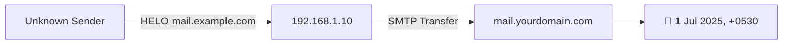

# 📧 Email Tracking

## 🔍 What is Email Tracking?

**Email Tracking** is the process of monitoring and analyzing email communication to extract critical metadata, such as:

* 📍 **Sender’s IP address**
* 🌐 **Geographic location** of the sender
* 📡 **Email service provider** used
* 🕒 **Time and date** of sending
* 📨 **Mail server hops** (via email headers)

📌 It is particularly useful in:

* Cyber forensics
* Incident response
* Phishing or spam investigations

---


---

## ⚙️ How Email Tracking Works

When an email is sent, each mail server it passes through adds a `Received:` header to the email metadata.

By examining these headers, investigators can:

* ✅ Trace the **origin IP address**
* 🧭 View **timestamp logs** of mail hops
* 🚨 Detect **header forgery** or **spoofing**

---

### 🧪 Example Email Header (Simplified)



---
#### Breakdown:

* `192.168.1.10` – Sender’s IP (could be masked or internal)
* `mail.example.com` – Sender’s mail server
* `Thu, 1 Jul 2025` – Time of receipt

---

## 🛠️ Use Cases of Email Tracking

* 🔐 Identifying the origin of **phishing or spam emails**
* 🕵️‍♂️ Investigating **email-related cybercrimes**
* 🧪 Verifying if an email came from a **spoofed domain**
* 🧨 Tracing **insider threats** or **leaked communications**

---

## 🧾 How to View Email Headers (with Download Method – Offline)

### ✅ Step-by-Step (Gmail)

1. Open the email.
2. Click the **3-dot menu (⋮)** near the reply button.
3. Select **"Download message"** — this saves a file with `.eml` extension.
4. Locate the `.eml` file in your **Downloads** folder.
5. **Right-click → Open with → Notepad** (or any text editor).

---

### 📂 Structure of the `.eml` or Raw Email File

When you open the downloaded file:

* Everything **above the first empty line** is the **email header**.
* Everything **after the empty line** is the **email body** (actual content).

Example:

```text
Received: from sender.domain.com (123.45.67.89)
Date: Tue, 2 Jul 2025 10:20:00 +0000
From: attacker@example.com
To: victim@example.com
Subject: Urgent Invoice

Hello, please check the attached invoice...
```

🔍 In this case:

* Header ends before the **empty line**
* Body starts **after the empty line**

---

### 🖥️ Outlook (Desktop App)

1. Double-click the email to open.
2. Go to **File → Save As** → Save as `.eml` or `.msg`.
3. Open in **Notepad** or **Outlook Viewer Tool**.
4. Analyze the header manually using built-in tools or offline scripts.

---

### 🛑 No Online Tool Needed

This method is useful in **offline forensics**, air-gapped analysis, or where **privacy/legal** policies prevent you from uploading headers to online tools.

---

## 🌐 Online Email Tracers

| Tool Name                                                                                    | Link                                      |
| -------------------------------------------------------------------------------------------- | ----------------------------------------- |
| [MXToolbox – Email Header Analyzer](https://mxtoolbox.com/EmailHeaders.aspx)                 | Analyzes mail hops, delays, IPs           |
| [WhatIsMyIPAddress – Header Analyzer](https://whatismyipaddress.com/email-header-analyzer)   | Extracts original sender IP               |
| [IP Tracker – Email Tracer](https://www.ip-tracker.org/email-tracer.php)                     | Traces email origin via IP                |
| [Google Admin Toolbox – Header Analyzer](https://toolbox.googleapps.com/apps/messageheader/) | Decodes Gmail headers with delay tracking |
| [MailTester – Email Check](https://mailtester.com/testmail.php)                              | Validates sender and tests email path     |

---

## 🧰 Email Tracking Tools (Pixel-based / Real-Time)

These tools track when the email is opened, the recipient’s device, IP address, and geolocation:

| Tool Name                                                     | Description                                     |
| ------------------------------------------------------------- | ----------------------------------------------- |
| [**GetNotify**](https://www.getnotify.com/)                   | Tracks opens/clicks, shows IP and location info |
| [**ReadNotify**](https://www.readnotify.com/)                 | Alerts when opened, read time, device type      |
| [**PoliteMail**](https://www.politemail.com/)                 | Outlook email analytics and tracking            |
| [**Email Lookup**](https://email-checker.net/email-lookup)    | Finds data from sender/receiver address         |
| [**eMailTrackerPro**](https://www.emailtrackerpro.com/)       | Full header analysis and origin tracing         |
| [**DidTheyReadIt**](https://www.didtheyreadit.com/)           | Real-time read notification via tracking pixel  |
| [**WhoReadMe**](https://whoreadme.com/)                       | Free tracker with open status + IP location     |
| [**G-Lock Analytics**](https://glockapps.com/email-tracking/) | Email campaign-level open tracking              |
| [**MSGTAG**](http://www.msgtag.com/)                          | Read receipts for desktop email clients         |
| [**Trace Email**](https://tools.iplocation.net/trace-email)   | Header-based origin tracing                     |
| **Lock Analytics**                                            | *(Possibly part of G-Lock, discontinued)*       |

---

## ⚠️ Privacy & Ethics Reminder

> These tools often use **invisible pixels** (a.k.a. tracking beacons) embedded in emails.
> ⚖️ Use them ethically. Respect recipient privacy and **always comply with laws** like GDPR, HIPAA, etc.

---

## ✅ Summary

| Action                | Description                                        |
| --------------------- | -------------------------------------------------- |
| 📥 Download email     | Use Gmail/Outlook to download `.eml` or `.msg`     |
| 🔍 View header        | Open in Notepad → read from top until empty line   |
| 🧠 Analyze IP         | Look for `Received:` headers → extract sender IP   |
| 🌍 Trace location     | Use IP in tools like `tracert`, `whois`, or `ping` |
| ❌ Avoid online tools? | Analyze completely offline with `.eml` in Notepad  |

---
📖 Reference: Notes inspired by guidance from Mr. Sachin Verma Sir ([Armour Infosec](https://www.armourinfosec.com/)) and enriched with further improvements and updates.
